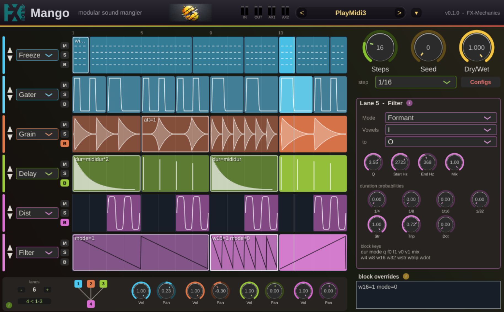

# Mango

**FX-Mechanics modular sound glitcher / mangler**: a JUCE audio effect (VST3 / AU /
Standalone) with MIDI input.

Demo video : https://youtu.be/Jsm9x_oHtCg?si=1vN9Y-DyYJyCsD78



Mango is a **rubber step sequencer** of up to eight lanes, each driving one
effect. You draw blocks on a lane's strip; while the playhead is inside a
block, that lane's effect is processing; outside it, the lane is transparent. So
you paint *when* each effect happens, in time with the host, and the lanes
stack into a chain from top to bottom.

The character is **seeded randomness**. Effects that need a rhythmic rate
don't take a fixed value: you weight how likely each note length is, and the
actual rate is drawn per block. Every draw is a pure function of the seed, the
lane and the block, so a pattern always plays back identically (in real time
and in an offline bounce alike), and changing the seed re-rolls everything at
once.

## Getting started

1. Insert Mango on a track that already has sound going through it (it is an
   effect, not an instrument).
2. **Drag across empty space** on a lane's strip to draw a block, then press
   play (the lane's effect fires while the playhead is inside it).
3. **Click the block to select it** (highlighted): the right column shows that
   lane's effect knobs, and the *block overrides* field at the bottom lets you
   retune this one block with a line of text (see below).
4. Change a lane's effect with the **dropdown** in its header; reorder lanes
   with the **▲▼ arrows** (order is the processing chain); use **M**/**S** to
   mute/solo.
5. Turn the **Seed** knob to re-roll every random choice at once; set **Steps**
   and the **step size** to size the grid.

### The sequencer

Every lane shares one grid, set once at the top-right: a step size (1/16…1/1)
and a step count (1–64). Blocks are edited directly on the strips:

| Gesture | Action |
|---------|--------|
| Drag empty space | Create a block |
| Click a block | Select it (click again to deselect) |
| Drag a block's body | Move it (it walls against its neighbours) |
| Drag a block's edge | Resize it |
| Alt-click, or Delete key | Delete the selected block |
| Right-click | Clear the block's override text |

Lanes have fixed identities: reordering only changes the display/processing
order, so a lane's blocks, settings and random draws follow it as it moves.
The **−/+ chooser** (bottom-left) sets how many lanes are shown; hidden lanes
keep sequencing silently, so bringing one back drops you straight back in step.

## Effects (selectable per lane)

Every effect has a wet/dry **mix** knob (override key `mix`; at 0 the lane is
transparent), except the ring modulator, whose **amount** plays that role,
and the aux send, whose **passthrough** does. For the delay, mix scales the
added repeats rather than crossfading.

| Effect  | What it does | Lane parameters |
|---------|--------------|-----------------|
| Gater   | Cuts the sound rhythmically: open(dur), closed(dur), ... starting open | duration probabilities, attack/release lengths + curves |
| Grain   | Records a grain at block start, loops it for the whole block (fixed 15 ms seam crossfade) | duration probabilities, per-repetition attack/release lengths + curves |
| Delay   | Feedback delay (buffer persists across blocks); damping mellows the repeats, portamento sets the time-glide (1–50 ms). With `dur=mididur fb=0.99` it is a Karplus-Strong style resonator tuned by MIDI | time, feedback, damping, portamento |
| Dist    | Tube-style saturation (Standard / Dynamic / Triode / Class AB). Saturation loudness depends on the input level, so the output gain (±24 dB, on the saturated signal) is the manual makeup | model, drive, bias, sag, out gain, mix |
| Filter  | LP / HP sweep from start to end frequency, or a formant vowel glide, repeating at a drawn rhythmic rate | mode, Q, start/end freq, start/end vowel, ramp probabilities |
| Quant   | Lo-fi: bit-depth reduction + sample-rate reduction (raw sample & hold, the aliasing is the point) | bits (1–24), downsample (÷1–64), mix |
| Ring    | Ring modulator: a sine carrier glides from a start to an end frequency over a drawn tempo-synced ramp, repeating for the block. Amount 0 = clean, 1 = full ring modulation (low frequencies give tremolo) | start/end freq (0.5 Hz–10 kHz), amount, glide probabilities |
| Rev     | Reverser: chops the audio into drawn-duration slices and plays each backwards (the first slice of a block passes through, nothing to reverse yet) | slice probabilities, seam fade |
| Freeze  | Spectral freeze (FFT): captures ~43 ms at block start (passed through while recording), then sustains its spectrum as a static, non-periodic wash. A rhythmic **retrigger** (drawn like the other rates, default straight 1/4) re-captures from the live sound on that grid, seamlessly, so it tracks a changing input in time; a block no longer than one step is a single capture. Width sets how similar L and R are (1 = fully decorrelated/wide, 0 = mono; equal-power, so the level stays constant) | mix, width, retrigger probabilities |
| Aux     | Rhythmic aux send: the gater's envelope, but it *routes* rather than cuts: while the gate is open the shaped signal is added to the two aux outputs at their send levels, and the main path passes at a constant passthrough level (1 = transparent, a send on top; 0 = the block leaves the main chain entirely). Needs the aux outputs enabled in the host | aux 1 / aux 2 send, passthrough, attack/release lengths + curves, duration probabilities |
| Pan     | Rhythmic panner: the gater's clock, but each step lands on one of three positions (hard left, centre, hard right) cycling rightwards (`->`), leftwards (`<-`), back and forth (`<->`, which turns round at the edges instead of jumping), or drawn per step from the seed. Glide sets how much of a step is spent travelling to the new position (0 clicks) | mode, glide, mix, duration probabilities |

**Duration probabilities** (gate rate, grain length, filter ramp, ring glide,
reverse slice, aux send rate, pan step, freeze retrigger): rather than a fixed rate you weight
1/4, 1/8, 1/16, 1/32 and straight / triplet / dotted; the actual duration is
drawn from those weights (e.g. with P(1/4)=1, P(1/8)=0.5, P(1/16)=0.1 the
chance of an uncut quarter is 1/1.6). The draw depends only on the seed, the
lane and the block, so the block picture always shows exactly what you'll hear.

**Attack / release** (gater open phase; each grain repetition, never the
whole block): lengths are fractions (0–1) of the shaped duration, so they
scale with the rate. If they sum past 1 they share the duration proportionally
(att=1, rel=0.5 acts as 2/3 + 1/3, a triangle with no sustain). The curve
knobs bend the edges: 0 slow, 0.5 straight, 1 very fast (a fast release ≈ an
exponential decay).

## Buses & routing

The **B** switch on a lane header starts a new bus at that row (row 1 always
starts bus 1), up to **four buses**. Lanes inside a bus run in series; the
buses run alongside each other. Lane colours show which bus a lane is in, each
one further down the bus shaded a little lighter. Every bus has its own
**volume** (0 mutes it) and **pan**, in the bus bar under the rack.

The button on the left of the bus bar cycles five **routing modes**, drawn as
a diagram of numbered boxes:

| Mode | Wiring |
|------|--------|
| Parallel | All buses process the input side by side; outputs summed |
| 3 ← 1+2  | Bus 3 processes the mix of buses 1+2; bus 4 (if any) stays parallel |
| 4 ← 1–3  | Bus 4 processes the mix of buses 1–3 |
| Diamond  | Bus 1 splits into buses 2 and 3, whose mix feeds bus 4 |
| Fan-out  | Bus 1 is a common front end feeding every remaining bus |

A mode that needs more buses than you have falls back to parallel, except the
fan-out, which simply fans out to however many buses there are. Note that a
bus with nothing sounding passes its input through, so several idle buses
side by side sum to more than unity (the usual parallel-rack behaviour); turn
an unused bus's volume down, or use the global dry/wet, to balance it.

## Per-block override language

*Full reference, printable:* [doc/minilanguage.md](doc/minilanguage.md)
(`make -C doc` renders it to PDF).

Select a block and type overrides into the *block overrides* field
(space-separated `key=value`, strict all-or-nothing parsing; an unparsable
string turns the field red and is kept for fixing):

```
dur=0.125 fb=0.6        eighth-note delay with more feedback
dur=mididur/2           half the period of the last MIDI note received
dur=mididur fb=0.99 damp=0.4    plucked-string resonance on the last note
f0=midifreq f1=midifreq*2       sweep from the note's fundamental to its octave
v0=a v1=u               formant glide from A to U
```

- `dur` as a plain number is a fraction of a whole note (0.25 = quarter, 0.125 =
  eighth) resolved against the host tempo; any expression with `mididur` is a
  time in seconds (`mididur`, `mididur*2`, `mididur/4`, `3*mididur`).
- Other keys are in the parameter's native unit:
  `fb damp porta att rel attcurve relcurve q f0 f1 v0 v1 bits down drive bias sag gain mix width model mode fade amp aux1 aux2 pass glide`
  and the duration probability weights `w4 w8 w16 w32 wstr wtrip wdot`
  (each effect reads the keys it understands).
- **`mididur`** is 1/f of the last MIDI note-on the plugin received, sampled when
  the block starts; **`midifreq`** is its frequency in Hz (1/mididur), for the
  frequency keys (`f0=midifreq`, `midifreq*2`, `midifreq/2`, `2*midifreq`).

## Global controls

The knobs at the top right apply to the whole plugin:

| Control | What it does |
|---------|--------------|
| **Steps** | How many steps long the pattern is (1–64). Shortening the pattern hides the blocks past the new end (an amber arrow at the right edge shows they are there) and lengthening it brings them back unchanged |
| **step** | The length of one step (1/16 … 1/1). Steps × step size is the pattern length: 16 steps of 1/16 is one bar |
| **Seed** | Re-rolls every random choice at once (0–99999). Turn it until you like what you hear; the same seed always plays the same way |
| **Dry/Wet** | Blends everything the plugin does against the untouched input |

The grid is shared: all lanes use the same step size and step count, so
blocks always line up across lanes.

The **lanes − / +** chooser at the bottom left sets how many lanes are shown
(1–8, four by default). Hidden lanes keep their blocks and settings, they
just stop processing, so you can park a lane without losing your work.

**Aux outputs**: besides the main stereo pair the plugin offers two extra
stereo outputs, **Aux 1** and **Aux 2**, declared disabled (enable them in
the host to use them). Lanes running the Aux effect feed them from wherever
they sit in the chain (the tap is before the bus volume/pan, so an aux send
is unaffected by the bus level or balance).

**Sequencer configs**: the **Configs** button swaps the lane panel for a bank
of 8 configuration slots (one row to load, one to store). A config is a
*pattern*, not a sound: it holds the blocks and their override strings, the
grid, the lane count/order/effect types, the whole bus routing (grouping,
mode, per-bus volume and pan) and the seed. Tick *include effect parameters*
(off by default) to store the effect knob values as well; slots that carry
them are underlined, so a recall is never a surprise. Mute, solo and the
global dry/wet are never stored, so a recall can't clobber your live mix.
Slots show their state (filled = active, outlined = stored, dim = empty,
dot = edited since loaded); alt-click a store slot to clear it, and *undo
store* takes back the last overwrite. Recalls can be
immediate or quantised to the next bar or pattern, so a switch lands in time.
The slot number is a plugin parameter, so your host can automate which config
is playing.

**Help**: the round **i** buttons open a short explanation of whatever they
sit next to: the selected lane's effect, the lanes-and-buses strip at the
bottom left, the config bank, and the block override language.

**Splash**: the cover art appears for two seconds the first time the editor
is opened in a run (not on every reopen), and any time you click the
FX-Mechanics logo or the mango artwork in the top bar. Click it to dismiss
it early.

**Meters**: the top bar carries four small stereo level meters (input,
main output, aux 1 and aux 2) reading RMS over −60..0 dBFS with a mark at
−6. An aux bus the host hasn't enabled simply reads silence.

**Presets**: the top bar hosts a compact preset strip (previous / name /
next) and a toggle that expands the full browser over the right column:
factory presets plus user presets saved as XML under the platform user-data
folder (`.../Mango/Presets`). Presets carry the complete state, sequencer
blocks and override strings included.

Everything responds live: turn a knob while a block is sounding and you hear
it straight away, without the effect restarting or losing its place in the
rhythm. Looping a section in your DAW replays it identically each time round.

## Building

JUCE is expected as a sibling directory (`../JUCE`); FxmeTools is a git
submodule:

```sh
git clone --recursive <this repo>
cmake -B build -DCMAKE_BUILD_TYPE=Release
cmake --build build -j
```

Tests (console, no audio device needed):

```sh
cmake -B build -DMANGO_BUILD_TESTS=ON
cmake --build build --target MangoTests MangoRenderTest -j
ctest --test-dir build
```

`MangoTests` covers the JUCE-free pieces (override parser, deterministic RNG,
weighted durations, FxmeTools DSP); `MangoRenderTest` renders audio through the
real processor and checks gate timing, host-tempo sync, seed determinism
(bit-exact), the override language and the state round-trip. Run
`MangoRenderTest <path.png>` to dump GUI snapshots instead.

### Releases (CI)

`.github/workflows/release.yml` builds the plugin on all three platforms and
publishes a GitHub release. Push a version tag to trigger it:

```sh
git tag v0.1.0
git push --tags
```

It produces a Linux x86_64 zip (VST3 + Standalone), a Windows x86_64 zip
(VST3 + Standalone) and a macOS **universal** (arm64 + x86_64) zip and `.pkg`
installer (VST3 + AU + Standalone). Run it from the Actions tab
(*workflow_dispatch*) to test the builds without cutting a release.

## Architecture notes

Full architecture reference (engine, threading, determinism, language, GUI,
FxmeTools additions, testing, invariants): [doc/architecture.md](doc/architecture.md).

- Lanes are fixed identities 0–7; reordering only permutes a display/processing
  order, so parameters, sequences and random draws stay with their lane.
- Sequencer model/engine/GUI come from [FxmeTools](https://github.com/odoare/FxmeTools)
  (`StringSequencer`, `SequencerEngine`, `SequencerRubber`), as do the DSP
  building blocks added for Mango (`Saturator`, `FormantFilter`, `BitCrusher`,
  `DelayLine`, `GrainLooper`, `ArEnvelope`, `DeterministicRandom`,
  `NoteDuration`) and the shared FX-Mechanics `TopBar`.
- One lock guards the sequencers + override cache; the audio thread holds it
  during processing, and everything the message thread does under it is tiny
  and allocation-free (strings are parsed outside, the cache map is swapped in).
- New effect types: subclass `mng::EffectBase`, add parameters through the
  static `addParameters(params, lanePrefix, name)` hook, register the type in
  `Source/Dsp/EffectTypes.h` and the factory in `MangoEngine.cpp`.

## Acknowledgements

Some effect lanes use the fast Fourier Transform engine of
[WDL](https://www.cockos.com/wdl/) (`WDL_WDL_fft`). WDL is © Cockos Incorporated (2006 and later),
distributed under the permissive zlib license. Thanks to Justin Frankel and the
Cockos team ([github.com/justinfrankel/WDL](https://github.com/justinfrankel/WDL)).

---
Author: Olivier Doaré · FX-Mechanics · LGPL-3.0-or-later
